# tabnews.com.br

## Instalação:

```
anahelena in GITs/AnaMarcacini/tabnews.com.br
➜  nvm ls
       v18.20.5
->      v19.9.0
        v22.3.0
         system
default -> 19 (-> v19.9.0)
iojs -> N/A (default)
unstable -> N/A (default)
node -> stable (-> v22.3.0) (default)
stable -> 22.3 (-> v22.3.0) (default)
lts/* -> lts/jod (-> N/A)
lts/argon -> v4.9.1 (-> N/A)
lts/boron -> v6.17.1 (-> N/A)
lts/carbon -> v8.17.0 (-> N/A)
lts/dubnium -> v10.24.1 (-> N/A)
lts/erbium -> v12.22.12 (-> N/A)
lts/fermium -> v14.21.3 (-> N/A)
lts/gallium -> v16.20.2 (-> N/A)
lts/hydrogen -> v18.20.5
lts/iron -> v20.18.1 (-> N/A)
lts/jod -> v22.12.0 (-> N/A)
```

Utilizaremos o `lts/hydrogen ` (lts = Long Term Support)

nvm install lts/hydrogen

nvm alias default lts/hydrogen

.nvmrc -> arquivo com os detalhes da versão do node

terminação rc -> Run Commands (ex bashrc)

Esse arquivo facilita as instalações da versão da aplicaação

```
➜  nvm install
Found '/home/anahelena/GITs/AnaMarcacini/tabnews.com.br/.nvmrc' with version <lts/hydrogen >
```

# Primeiros passos

npm init

Vantagem de usar o Next.js

       Cuida do Limite entre o servidor e a aplicação do usuário
       Possui uma das melhores integrações entre o framework e Web Host

Foi desenvolvido pela vercel que oferece hospedagens de sites

npm install next@13.1.6

"Next cria as paredes e a sustancia é criada pelo react"

npm install react@18.2.0

npm install react-dom@18.2.0

# Protocolos Web

HTTP - hypertext transfer protocol - contem referencia para outros documentos
FTP - tranferencia de arquivos
SMTP - tranferencia de emails

TCP X UDP

# Criando a estrutura do nosso app

toda pagina index.js torna o diretório que a contém vira uma rota publica
Arquivos com outro nome tipo ana.js vira uma rota pública a parte /ana


usando npm run dev no ambiente de desenvolvimento code spaces cria um link público só acessível pela sua conta do github

Para liberar o acesso


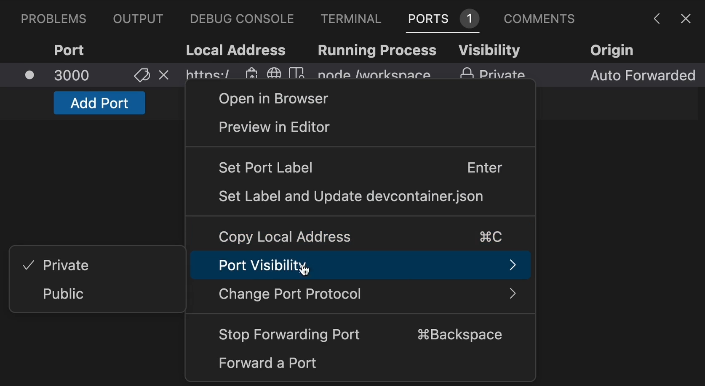

# Git

A cada commit o git guarda fotos do estado dos seus arquivos chamados
Blob: binary large object

Estados dos arquivos

- Untracked
- Modified
- Staged
- Commit

# Hospedagem

oferecer abrigo

inicialmente no proprio pc -> quando desligava acabava energia dava ruim

depois passou a fazer deploy via ftp em pcs com redundância de internet e energia para oferecer disponibilidade -> problema de versionamento

depois codava no proprio servidor via ssh -> problema de passar para o local

utilizar o git em tudo no servidor, no local e no remoto :
local envia para o CI (Continue Integration) e realiza testes para ver se está tudo certo
caso esteja vai para um terceiro local para buildar
e depois envia para o servidor

Habilitar o acesso da vercel
-> configurações do git -> applications -> vercel

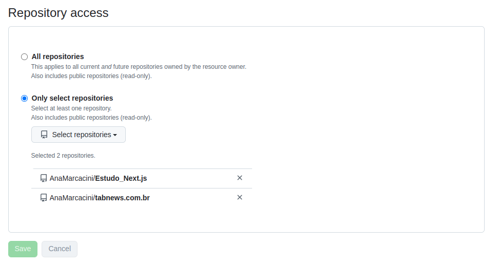

# Baixando dependências só de desenvolvimento

--D
npm i prettier --D  
no package.json
"devDependencies": {
"prettier": "^3.4.2"
}
lint -> analise estática de código

add novo script de validação da formatação do código

"scripts": {
"dev": "next dev",
"lint:check": "prettier --check ."
},

agora quando rodo

npm run lint:check

> tabnews.com.br@1.0.0 lint:check
> prettier --check .

Checking formatting...
[warn] Notas Ana/Readme.md
[warn] package.json
[warn] pages/index.js
[warn] Code style issues found in 3 files. Run Prettier with --write to fix.

script para corrigir a formação
"lint:fix": "prettier --write ."

# DNS (Domain Name Service)

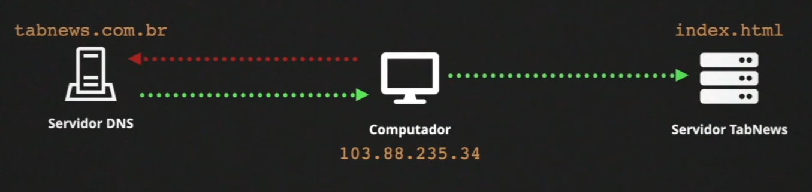

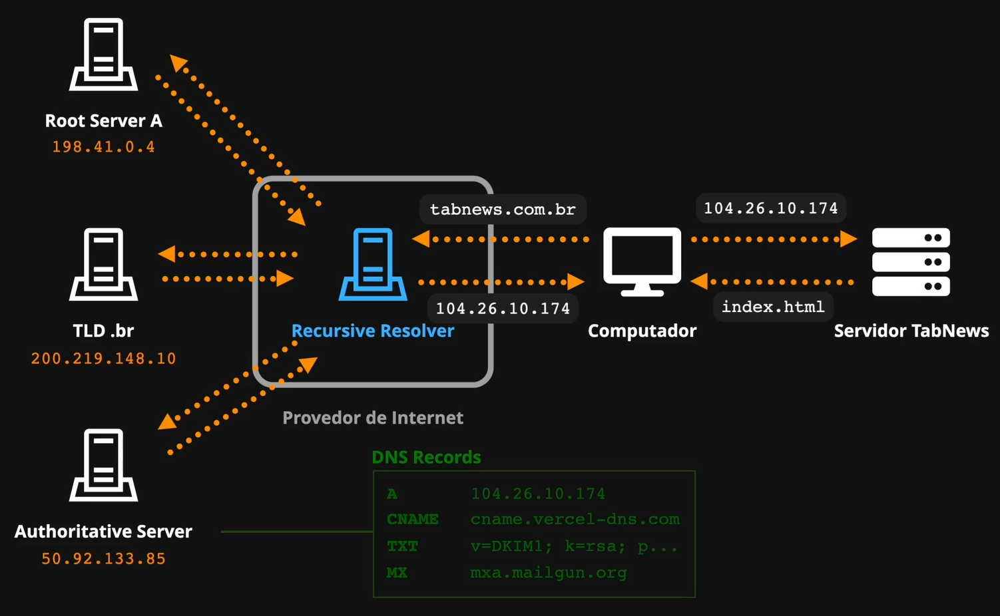

TTL : Time to Live -> cache
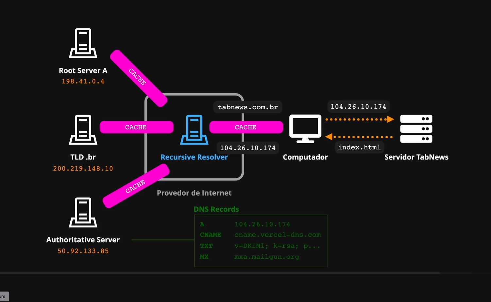

registro.br -> cuida de todos os registros .br

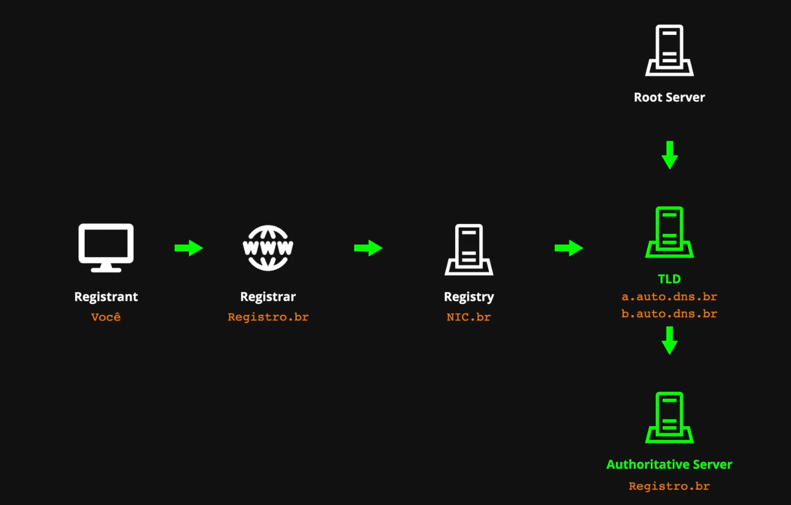

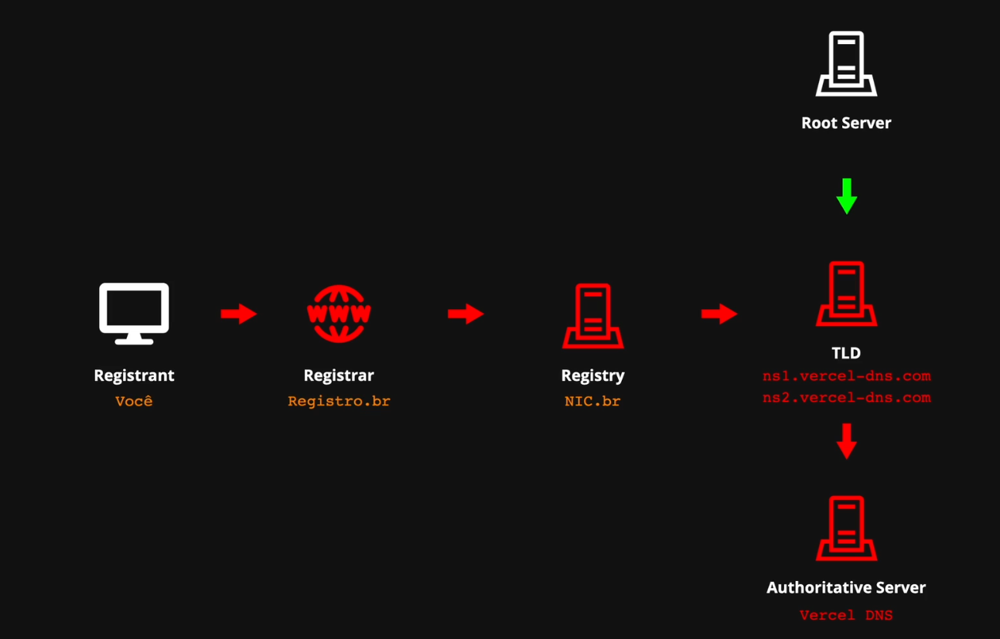

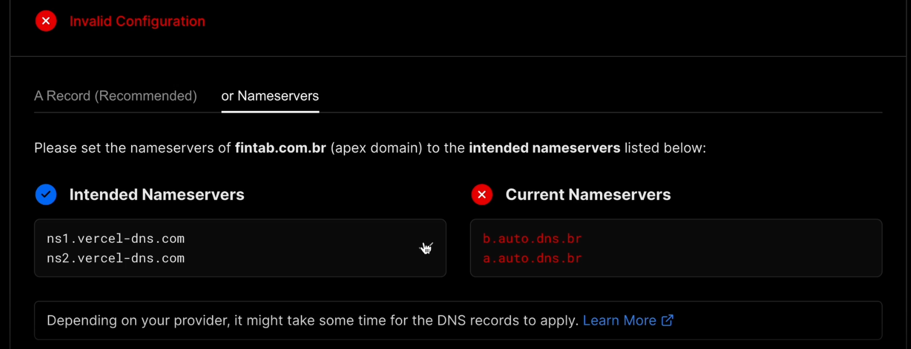

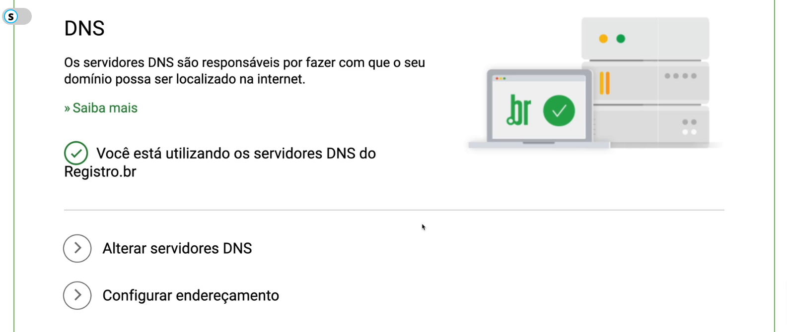

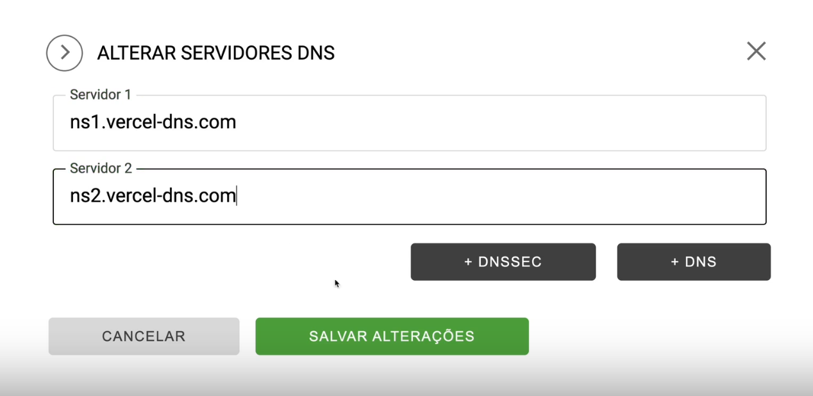

## Comando Dig

sudo apt install dnsutils

O comando dig (Domain Information Groper) é uma ferramenta de linha de comando usada para realizar **consultas ao DNS** (Domain Name System). Ele permite resolver nomes de domínio em endereços IP e vice-versa, além de obter informações detalhadas sobre registros DNS de um domínio.

**Resolver nomes de domínio:**

    dig google.com

**Obter registros DNS específicos:** Você pode consultar diferentes tipos de registros DNS, como:

    A (endereço IPv4)
    AAAA (endereço IPv6)
    MX (servidores de e-mail)
    NS (servidores de nomes)
    CNAME (nome canônico)
    TXT (informações em texto)

dig google.com MX

**Consultar um servidor DNS específico:** Você pode especificar qual servidor DNS usar para a consulta.
dig @8.8.8.8 google.com

**Mostrar apenas a resposta (modo simplificado):**

    dig +short google.com

dig google.com +trace

# Disponibilidade da Aplicação

SLA -> Service Level Agreement (Acordo de Nível de Serviço)

AWS status
Vercel status
etc
-> Ver dados do serviço e as vezes que o mesmo saiu do ar

    Status Pages
    Vercel: https://www.vercel-status.com/
    AWS: https://health.aws.amazon.com/health/status
    GitHub: https://www.githubstatus.com/

# Arquitetura e Engenharia de Software

- POC : Proof of Concept
  -> provas que o conceito vai funcionar --> não funcional
- MVP - Minimum Viable Product
  -> Realmente o produto finalizado e viável

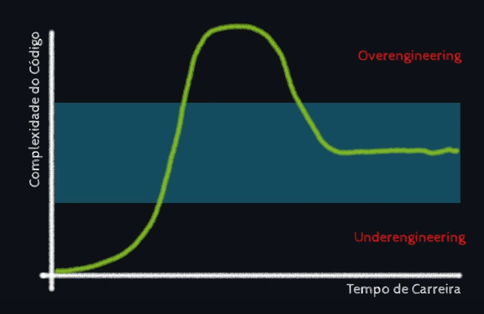
